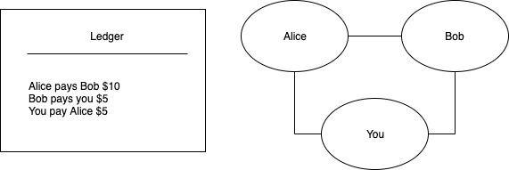
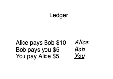
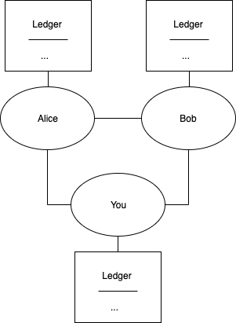
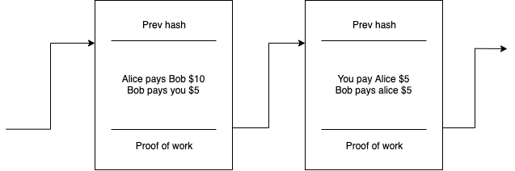
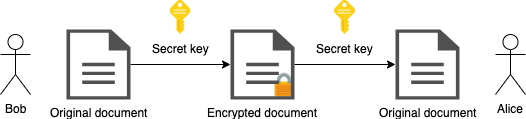
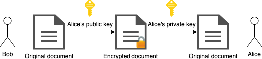
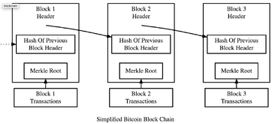

# 1. Introduction to Blockchain

In this chapter we will get ourselves introduced to some definitions and examples for blockchain. We will see what properties a blockchain has, what it allows us to do and what it is good for.

I> ### Definition 1
I>
I> Cryptocurrency is a digital currency in which encryption techniques are used to regulate the generation of units of currency and verify the transfer of funds, operating independently of a central bank.

I> ### Definition 2
I>
I> Blockchain is a system in which a record of transactions made in a cryptocurrency system are maintained across several computers that are linked in a peer-to-peer network.

We will try to give an example that will serve as a motivation, as well as define what are encryption and hashing techniques and how will they help us in making our system.

## 1.1. Motivation

Let's assume that you and your friends exchange money often, for example, paying for dinner or drinks, it can be inconvenient to exchange cash all the time. One possible solution to this is that you and your friends can agree to keep records of all the bills that you have. This is what is called a ledger.

I> ### Definition 3
I>
I> A ledger is a book that contains a record of transactions.

Then, at the end of every day you all sit together and use the ledger to do the calculations to settle up. If you spend more than you received, you put that money in the pot, otherwise you take that money out. Every peer in the system has a *wallet* of a kind, that resembles the balance for them. Note that we have to go through all existing records in order to do calculations[^ch1n1]. 

A problem that might appear with this kind of system is that anyone can add a transaction. For example, Bob can add a transaction where Alice pays him a few dollars, without Alice approving. We need to re-think our system such that all transactions in it are verified/signed.

For signing and verifying transactions, we will use digital signatures. For now, let's assume that anyone who adds information to the ledger also adds a signature with each record, and others have no way to modify the signature, but only to verify it.

However, now let's assume that Bob is keeping the ledger to himself, and everybody agreed to this. The ledger is now stored in what is called a *centralized authority*. But, if at the end of the day, say Bob has some errands to run, nobody will be able to refer to the ledger.

We need a way to decentralize the ledger, such that at any given time any of the peers can do a transaction. For the purpose of this, every peer involved will keep a copy of the ledger to themselves, and when they meet at the end of the day they will sync their ledgers.

You are connected to your friends, and so are they to you. Informally, this makes a peer-to-peer network.

I> ### Definition 4
I>
I> A peer-to-peer network is formed when two or more computers are connected to each other.

For example, when you are accessing a web page on the Internet using a browser, your browser is the "client" and the web page you're addressing is hosted by a "server". This distinction is blurred in a peer-to-peer network, so every peer is both client and server at the same time.

With this system, as the list of peers grows we might run into a problem of *trust*. When everybody meets at the end of the day, how can they believe the others that the transactions listed in their own ledgers are true? We need to modify our system to support a kind of trust.

Let's say that, for each record, we will also include a special "number" (or a hash) that will represent a kind of a *proof of work*, in that it will provide proof that the transaction is really valid. For every proof of work, the users will be given some amount as a reward.

At the end of the day, we say that we will trust the ledger who has put the most of the work in it. So if Bob has some errands to run, he can catch up the next day by trusting the rest of the peers in the network. In addition to this, we want the transactions to have an order, so let's say that every record contains a link to a previous record.

So if everybody agreed to use this ledger as a source of truth, there would be no need to exchange physical money at all. Everybody can just use the ledger to put or retrieve money to it.

## 1.2. Encryption

I> ### Definition 5
I>
I> Encryption is a two-way function; what is encrypted can be decrypted with the proper key. It is a method of encoding values such that only authorized persons can view the original content.

So we can assume that there are functions {$$}E(x){/$$} and {$$}D(x){/$$} for encryption and decryption respectively. Now we want these functions to have the following properties:

1. {$$}E(x) \neq x{/$$}, meaning that the encrypted value should not be the same as the value we're trying to encrypt
1. {$$}E(x) \neq D(x){/$$}, meaning that the encrypted value should not be the same as the decrypted value
1. {$$}D(E(x)) = x{/$$}, meaning that the decryption of an encrypted value should return the original value

So if we assume there's some kind of an encryption scheme, say {$$}E(\text{"Boro"}) = \text{426f726f}{/$$}, we can "safely" communicate with others the value {$$}\text{426f726f}{/$$} without actually exposing our original value, and only those who know the decryption scheme {$$}D(x){/$$} will be able to see that {$$}D(\text{426f726f}) = \text{"Boro"}{/$$}.

However, the scheme described above is what is called a symmetric algorithm, meaning that we share the functions {$$}E{/$$} and {$$}D{/$$} with the parties involved, and as such, may be open to attacks given how we want to design our transactions, which we will cover in a later topic.

So, what we want to use is what is called a asymmetric algorithm or a public-key cryptography. This means that we have two kind of keys: public and private. We share the public key with the world, and keep the private one to ourselves.

This algorithm scheme has a neat property in that only the private key can decode a message, and the public one can encode a message.

Note that the way we use the words encode and decode is abstract. This means that, for example, in terms of digital signatures for our transactions, a message can be signed with the sender's private key and can be verified by anyone who has access to the sender's public key.

So, given {$$}\text{TransactionSignature} = \text{Sign}(x, \text{PrivateKey}){/$$} and a verification function {$$}\text{Verify}(\text{Message}, x, \text{key}){/$$}, we want to be able to do {$$}\text{Verify}(\text{Message}, \text{TransactionSignature}, \text{PublicKey}){/$$} in order to confirm a transaction's ownership.

This brings us to wallets.

Wallet stores the public and private "keys" or "addresses" which can be used to receive or spend cryptocurrency coins. With the private key, it is possible to write new blocks (or transactions) on the blockchain, effectively spending the associated cryptocurrency. With the public key, it is possible for others to send currency to the wallet and verify signatures.

TODO: Example in Racket

## 1.3. Hashing

I> ### Definition 6
I>
I> Hashing is a one-way function that encodes text without a way to retrieve the original contents back.

Hashing, however, is simpler than the encryption schemes described above.

One example why we would need to use such technique is because they have some interesting properties, such as providing us with the so called notion proof-of-work.

I> ### Definition 7
I>
I> A proof-of-work system is an economic measure to deter denial of service attacks and other service abuses such as spam on a network by requiring some work from the service requester, usually meaning processing time by a computer.

Hashcash is a proof-of-work system, initially targeted for limiting email spam and other attacks. However, recently it's also become known for its usage in cryptocurrencies as part of the mining process. Hashcash was proposed in 1997 by Adam Backa. We will see how this algorithm works in details in the later chapters where we will implement it.

I> ### Definition 8
I>
I> Mining is a validation of transactions. For this effort, successful miners obtain new cryptocurrency as a reward. The Hashcash algorithm is what we will use to implement mining.

In Bitcoin, the block reward started at 50 coins for the first block, and halves every on every 210000 blocks. This means every block up until block 210000 rewards 50 coins, while block 210001 rewards 25. As we will see in the code, we will come up with a function to determine the reward that is supposed to be given to the owner depending on the state of the blockchain at that point in time.

Another useful property hashing functions have is to connect two or more distinct blocks by having the information `current-hash` and `previous-hash`.

For example, `block-1` may have a hash such as `0x123456` and `block-2` may have a hash such as `0x345678`. Now, `block-2`'s `previous-hash` will be `block-1`'s `current-hash`, that is, `0x123456`, and in this way we've made a link between these two blocks.

Two or more blocks (or transactions) connected to each other form what is called a blockchain. The validity of each cryptocurrency coins is provided by it.

Fortunately for us, Racket has libraries that will provide this for us, so we don't have to dig deeper into how hashing and encryption and decryption works but a basic understanding of it will be sufficient.

## 1.4. Bitcoin

Bitcoin is the world's first cryptocurrency. In November 2008, a link to a paper authored by Satoshi Nakamoto titled "Bitcoin: A Peer-to-Peer Electronic Cash System" was published on a cryptography mailing list. Bitcoin's white paper is consisted of 9 pages, however, it is mostly theoretical explanation of the design, and as such may be a bit overwhelming to newcomers.

The bitcoin software is open source code and was released in January 2009 on SourceForge. As a result of that, anyone can clone the code and make their own blockchain, thus implementing a separate cryptocurrency. Such cryptocurrencies are usually called altcoins. The design of a bitcoin includes a decentralized network (peer-to-peer network), block (mining), blockchain, transactions, and wallets, each of which we will look in details in this book.

Although there are many cryptocurrency models and each one of them differ slightly in implementation details, the cryptocurrency we'll be building upon in this book will look pretty similar to Bitcoin (with some parts being simplified). After having read this book, readers can refer to the white paper to get the complete picture for the implementation details.

## 1.5. Example workflows

### 1.5.1. Adding block to a blockchain

TODO

### 1.5.2. Mining a block

TODO

### 1.5.3. Checking wallet balance

TODO

### 1.5.4. Sending money

TODO

## 1.6. Cryptojacking

Modern browsers powerful contain a built-in programming language javascript

So when you visit a webpage on the Internet, javascript can be told to start mining

Cryptojacking is the unauthorized use of someone else's computer to mine cryptocurrency.

Since as we've seen, miners get reward for mining, this is a motivation for cryptojacking.

TODO: Add some images

## Summary

Here's what we learned in this chapter, briefly:

1. As the most basic building block, we have a transaction record (block)
1. A block contains (among other data) transactions
1. We have a ledger that is a ordered list of all valid blocks (blockchain)
1. Every peer involved with the ledger has a wallet
1. Every record in the ledger is signed by the owner, and can be verified by the public (digital signatures)
1. The ledger is in a decentralized location, that is, everybody has their own copy of the ledger
1. Trust is based upon proof of work (mining)

[^ch1n1]: There is a way we can optimize this with so called unspent *transaction outputs* (UTXOs), which we will discuss in details later.
