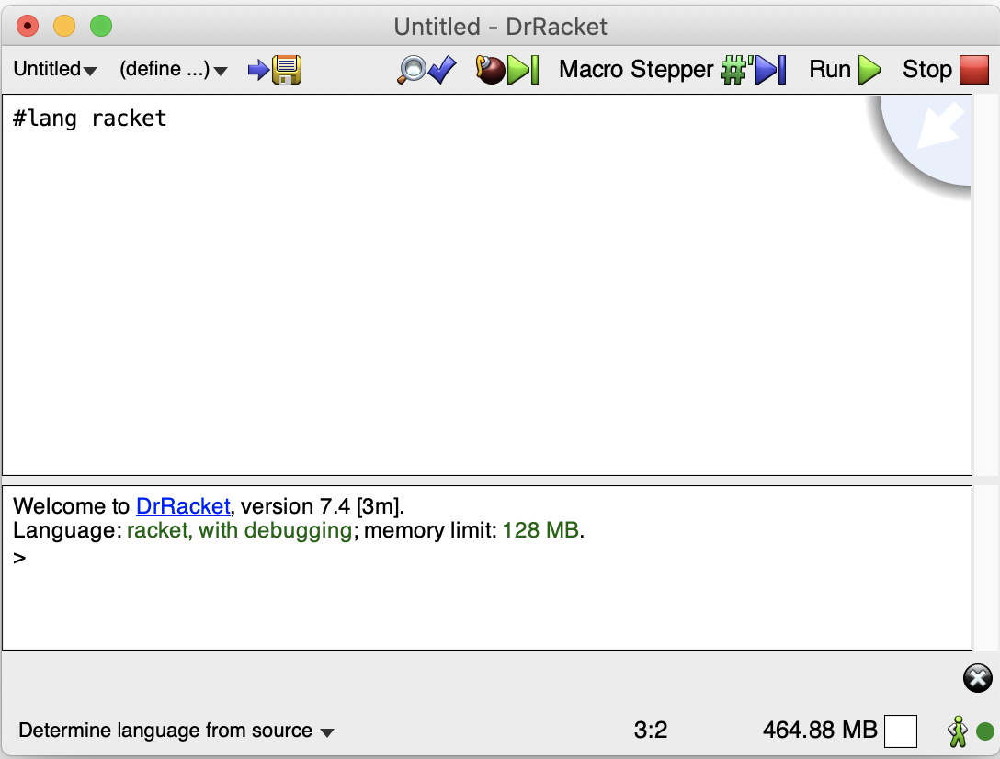

# 2. Racket programming language

## 2.1. Introduction to Lisp

Lisp, originating from 1958, stands for LISt Processing. Unlike standard programming languages, it has a fully parenthesized prefix notation. For example, instead of writing `1 + 2`, one would write `(+ 1 2)`.

There are three important notions in a Lisp:

1. Primitives or axioms, starting points. As an example, the numbers 1, 2, etc. are something we do not have to implement ourselves since they are already included in the programming language. Another example is operations upon the numbers, such as `+`, `*`, etc.
1. Composition or a way to compose primitives to do complex calculations. For example we can combine `+` and `*` as follows: `1 + (2 * 3)` or in prefix notation: `(+ 1 (* 2 3))`
1. Abstraction or capturing the composition of primitives. For example, if we find ourselves doing some calculation over and over again, it would be good to capture (abstract, or wrap) it in a function that can be easily re-used

I> ### Definition 1
I>
I> A data structure is a collection of values, the relationships among them, and the functions or operations that can be applied to the data.

As we have mentioned, an example of a data structure is numbers together with the plus and multiplication functions.

From the motivation in the previous section we can see a need of forming such a composite data type, where, for example, a block is a structure that contains a hash, an owner, transaction amount, etc.

There are many data structures. An ordered list is one example, representing the numbers {$$}(1, 2, 3){/$$} in that order. There are operations on lists, such as counting the number of elements, appending two lists, etc.

I> ### Definition 2
I>
I> In mathematics and computer science, objects exhibit recursive behavior when they can be defined by two properties:
I>
I> 1. A simple base case (or cases) - a terminating case that returns a value without using recursion
I> 1. A set of rules that reduce all other cases toward the base case

The best example is the factorial function, defined as:

{$$}fact(n) = \left\{ \begin{array}{ll} 1\text{, if } n = 0 \\	n * fact(n - 1)\text{, otherwise} \end{array} \right.{/$$}

For example, using only substitution we can see that {$$}fact(3){/$$} evaluates to {$$}3 \cdot fact(2){/$$} which is {$$}3 \cdot 2 \cdot fact(1){/$$}, and then finally {$$}3 \cdot 2 \cdot 1 \cdot fact(0){/$$} which is just 6.

I> ### Definition 3
I>
I> A tree is a hierarchical, recursive data structure that can have two possible values:
I>
I> 1. An empty value
I> 1. A single value, coupled together with another two sub-trees

A family tree is one example of a tree. Another example of a tree is a binary tree where the left subtree's value is less than the current value and the right subtree's value is greater than the current value:

```text
  2
 / \
1   3
```

I> ### Definition 4
I>
I> A **language** is consisted of:
I>
I> 1. _Symbols_, which can be combined into sentences
I> 1. _Grammar_, which is a set of rules that tells us which sentences are well-formed

The definition of a language also reflects programming languages where they have a special grammar - syntax. For example, the C programming language has a special syntax - you have to follow specific rules when writing program statements. 

I> ### Definition 5
I>
I> An abstract syntax tree is a tree representation of the abstract syntactic structure of a source code written in a programming language.

When you write a program in a programming language, there's an intermediate step that parses the program's source code and derives an abstract syntax tree.


For example, the image above represents an abstract syntax tree for the following code in C:

```c
while (x > 0) {
    x = x - 1;
    y = y * 2;
}
```

It is not important to understand what this code does, rather how such programs are represented internally in programming languages.

Lisps do not have the restriction of a special syntax like C has, for example. What we will write as code will be the actual abstract syntax tree. This is why Lisps rely on prefix notation. Thus, Lisps are based on a minimalistic design, so we do not get the overhead of many other languages that have special syntax where sometimes some functionalities overlap with existing ones.

Due to this minimalism, building a cryptocurrency (or anything, for that matter) in Lisp will imply that you can do the same in most other programming languages with ease. This programming language favors function composition, and further in the book, we'll see the interesting properties that composition offers and how easily we can maintain and extend our code.

I> ### Definition 6
I>
I> The syntactic elements in Lisp are symbolic expressions or S-expressions. S-expressions can be either a symbol or a list.

S-expressions form the syntax of a Lisp. Thus, the word syntax has a special meaning in Lisps, compared to other languages. With macros as part of the core language, it's possible to extend the syntax[^ch2n1].

The Racket programming language that we will use in this book is a multi-paradigm programming language, belonging to the Lisp family.

## 2.2. Why Racket

Racket (formerly known as PLT Scheme) is a Lisp. It's not just Lisp, rather a Lisp, since there are many Lisp implementations, but we found this one to be particularly easy for entry-level programmers.

The language is used in a variety of contexts such as scripting, general-purpose programming, computer science education, and research. It has been used for commercial projects. One notable example is the Hacker News website, which runs on Arc, a programming language developed in Racket. Racket is also used to teach students algebra through game development.

Scheme, the programming language from which Racket was influenced and based upon, was created in the 1970s at MIT by Guy L. Steele and Gerald Jay Sussman. Scheme is widely used by several schools, as a programming language in introductory courses for computer science.

There are two main approaches to work with Racket:

1. Using the graphical user interface (GUI), which is the recommended way and the way that we will use throughout this book
1. Using the command line utilities (`racket` - the interpreter/compiler, `raco` - the package manager, etc) for more advanced users

## 2.3. Configuration and installation

Racket can be downloaded and installed via https://download.racket-lang.org. There are available binaries for Windows, Linux, and Mac. After having downloaded and installed the complete package, we can run DrRacket. If you get the following screen after trying to run it, congratulations! It means that the installation was successful.



The upper text area part is the definitions area, where we usually write our definitions. Alternatively, the lower part is the interaction area where we interact with the definitions.

The Help Desk under `Help > Help Desk` contains useful information such as quick introduction, reference manuals, examples, etc. which is also available in offline-mode but is optional for this book.

## 2.4. Tutorial

The first thing that Lisp newcomers notice is that there are too many parentheses in most Lisp programs. This is true, but it is a direct consequence of that we are writing our abstract syntax tree in a language that has no special syntax.

As we go through this book, we will understand the power of expressiveness we get as a result. For example, one advantage is that there is no need for a special order of operations. In high school, we had to remember that `*` and `/` have to come before `+` and `-`. This is not the case with Lisps, as the order of evaluation is obvious by the way we've written our program.

Let's start by writing `(+ 1 (* 2 3))`, followed by the return key, in the interactions area of the DrRacket editor:

```racket
> (+ 1 (* 2 3))
7
```

If you get 7 as a result, then congratulations! You have done your first calculation in Racket.

After it finishes an evaluation, DrRacket again waits for us to input a new command. This is so because in the interactions area we are in the REPL mode, which stands for Read-Evaluate-Print-Loop. That is, the interactions area will read what we write, try to evaluate it (come up with a result), print the result, and loop back to reading again.

Lisp evaluation is very similar to substitution in mathematics. For example, one way `(+ 1 (* 2 3))` can be evaluated is as follows:

1. `(+ 1 (* 2 3))`
1. `(+ 1 6)`
1. `7`

We immediately notice how powerful substitution as a concept is.

### 2.4.1. Primitive types

In the evaluation we've done above, what we get as a result is a number. So the value 7 has a type of number. While this may be implicit in Racket, we have a way to check what the type of a value is, as we will see later with the help of predicates.

Racket has some primitive types, such as:

1. Symbols - more about them in the next section
1. Numbers - 1, 2, 3.14
1. Booleans - True, False
1. Characters - or single letters: #\A, #\B, #\C
1. Strings - or list of characters: "Hello", "World"
1. Lists - (1, 2, 3)
1. Functions - f(x) = x + 1

```racket
> 123
123
> #t
#t
> #f
#f
> #\A
#\A
> "Hello World"
"Hello World"
```

Each of the evaluations above has a specific type attached to the value produced:

1. The first evaluation has a type of number
1. The second evaluation (which stands for true) has a type of boolean
1. The third evaluation (which stands for false) has a type of boolean
1. The fourth evaluation has a type of character
1. The fifth evaluation has a type of string

### 2.4.2. Lists, evaluation, quotes

In order to produce the ordered list {$$}(1, 2, 3){/$$}, we can ask DrRacket to evaluate `(list 1 2 3)`:

```racket
> (list 1 2 3)
'(1 2 3)
```

`list` is a built-in function, just like `+`. `list` accepts any number of parameters, and as a result, returns a list generated from them.

We notice how parentheses are used to denote a function call, or evaluation. In general, the code `(f a_1 a_2 ... a_n)` makes a function call to `f`, passing `n` parameters in that order. For example, for the function {$$}f(x) = x + 1{/$$}, one example evaluation is {$$}f(1){/$$} where as a return value we get 2.

However, now, as a result, we get `'(1 2 3)`. Let's try to understand what happened here. If it had returned `(1 2 3)`, this wouldn't have made much sense, since as we discussed above this notation would try to call the function 1 with arguments 2 and 3. Instead, it returned a *quoted* list. This is the same as saying `'(1 2 3)`.

To understand how this affects the evaluation model better, let's consider an example where you say either of these statements to some friend of yours:

1. Say your name
1. Say "your name"

In the first example, you expect your friend to tell you their name. However, in the second example, you expect them to say "your name", rather than their actual name.

There is a built-in syntax called `quote`. So the expression `'(1 2 3)` is just a fancy notation which is equivalent to the expression `(quote (1 2 3))`, where we tell Racket to return the actual list `(1 2 3)`, instead of evaluating it.

There is a special list, called the empty list and is denoted as `'()` or `(quote ())`. We will later see why this list is special when we'll talk about recursion.

Also, note that we can use `quote` on any set of symbols:

```racket
> (quote hello)
'hello
```

This allows for the creation of new symbols and is especially important for the creation of macros.

### 2.4.3. Pairs

Another built-in function is `cons` which stands for construct. This function only accepts two parameters, and as a result, it returns a pair:

```racket
> (cons 1 2)
'(1 . 2)
```


There are two other built-in functions called `car` and `cdr` which are used to retrieve the first and the second element of a pair respectively:

```racket
> (car (cons 1 2))
1
> (cdr (cons 1 2))
2
```

Pairs are so important that we can encode any data structure with them. In fact, lists are a special kind of pairs, where `(list 1 2 3)` is equal to `(cons 1 (cons 2 (cons 3 '())))`.


The motivation for using a list is that it will allow us, for example, to link several blocks together to make a blockchain.

Finally, we notice how in Lisp, depending only on a few primitive notions (function calls, pairs, `quote`) we can interestingly build abstraction.

### 2.4.4. Adding definitions

So far, we have only worked with the interactions area in DrRacket. Let's try to do something useful with the definitions area.


We can notice a couple of things from the screenshot above:

1. In the definitions area, we added some code. We notice that we used another built-in syntax called `define` to attach a value (`123`) to a symbol (`a-number`)
1. In the interactions area, we interacted with something that was already defined in the definitions area (in this case, the interaction was to just display its value)

In this book, every Racket program will start with `#lang racket`. This means that we will be dealing with Racket's ordinary syntax. There are other values this can accept, for example, we can work with a language specialized in drawing graphics, but that is out of context for this book.

Everything that we type in the definitions area, we can also type in the interactions area and vice-versa. To have the definitions available in the interactions area we need to Run the program by navigating to the top menu `Racket > Run`. Note that when we Run a program, the interactions area gets cleared.

If our definitions have references, using the mouse we can hover over the symbol's name and DrRacket will draw a line pointing to the definition of that reference. For big and complex programs, it is advised to use this approach to fully understand how one function works, when necessary.


Definitions can be saved to a file for later usage by navigating to `File > Save Definitions`.

### 2.4.5. Procedures and functions

In Lisp, a procedure is essentially a function. When invoked, it returns some data as its value. However, some Lisp expressions and procedures have side effects, for example, doing a network operation, which means that this "function" can return different values at different points in time. Thus Lisp procedures are not always functions in the "pure" sense of mathematics, but in practice, they are frequently referred to as "functions" anyway, even those that may have side effects, to emphasize that a computed result is always returned.

From this point, we will refrain from using the word `function` and stick to `procedure`.

There is a special built-in syntax called `lambda`, which accepts two parameters, and produces a procedure for us as a result. The first parameter is a list of arguments this procedure accepts, and the second parameter is an expression that acts upon these parameters.

For example, `(lambda (x) (+ x 1))` returns a procedure that accepts a single parameter, and when this procedure is called with a parameter, it increases this parameter's value by one.

If we try to evaluate the expression above, we get:

```racket
> (lambda (x) (+ x 1))
#<procedure>
```

In order to call our procedure, we can try to pass a parameter to its return value:

```racket
> ((lambda (x) (+ x 1)) 1)
2
```

Of course, writing and evaluating procedures this way is hard. Instead, we can define our procedure in the definitions area and then interact with it in the interactions area:

Definition:

```racket
(define add-one (lambda (x) (+ x 1)))
```

Interaction:

```racket
> (add-one 1)
2
> (add-one 2)
3
> (add-one (add-one 1))
3
```

To make things a little bit easier for us, Racket has a special syntax for defining procedures, so these two are equivalent:

```racket
(define add-one (lambda (x) (+ x 1)))
(define (add-one x) (+ x 1))
```

### 2.4.6. Comparison procedures

There are some very useful procedures that produce boolean output for us, such as checking whether a number is greater than another one, or whether a value is a number. We can notice the usage of some of them in the code below:

```racket
> (number? 1)
#t
> (number? "hello")
#f
> (character? #\A)
#t
> (string? "hello")
#t
> (procedure? add-one)
#t
> (symbol? (quote hey))
#t
> (symbol? 1)
#f
> (> 1 2)
#f
> (= 1 2)
#f
> (= 1 1)
#t
```

We can also do a conditional check, and evaluate expressions based on the truthiness of some predicate (comparison procedure). For example, `if` is a built-in syntax that accepts three parameters:

1. Conditional to check
1. Expression to evaluate if the conditional is true
1. Expression to evaluate if the conditional is false

Here are a few example usages:

```racket
> (if (= 1 1) "It is true" "It is not true")
"It is true"
> (if (= 1 2) "It is true" "It is not true")
"It is not true"
```

The more general syntax for `if` is `cond`, which has the following syntax:

```racket
(cond (test-1 action-1)
      (test-2 action-2)
      ...
      (test-n action-n))
```

Optionally, the last test can be an `else` to use the specific action if none of the conditions above match.

As an example, here is one way to use `cond` in a definition:

```racket
(define (is-large x)
  (cond ((> x 10) #t)
        (else #f)))
```

Interacting with it:

```racket
> (is-large 5)
#f
> (is-large 10)
#f
> (is-large 11)
#t
```

As we've seen, the `=` is an equivalence predicate used to check whether two numbers are equal. However, it works only on numbers and it will raise an error if we use it on anything else:

```racket
> (= 1 2)
#f
> (= 3.14 3.14)
#t
> (= '() '())
=: contract violation
```

There are three other important predicates:

1. `eq?` - checks whether the two parameters refer to the same object in memory
1. `eqv?` - the same as `eq?`, except that also it can be used for primitive types (e.g. numbers, strings)
1. `equal?` - the same as `eqv?`, except that also it can be used to check if the arguments have the same recursive structure (e.g. lists)

Note that there's only one empty list `'()` in memory (actually the empty list doesn't exist in memory, but a pointer to the memory location 0 is considered as the empty list). This means that all three predicates will return true for checking an empty list against an empty list.

To show where `eq?` fails, we will introduce a new procedure `integer->char` that converts a number to a character. Here are some examples using `eq?`:

```racket
> (integer->char 65)
#\A
> (eq? '() '())
#t
> (eq? '(1) '(1))
#f
> (eq? (integer->char 65) (integer->char 65))
#f
```

As expected, it will return true for the empty list, but is not able to compare lists that actually have elements, or objects that aren't referred to the same memory location. Note how `eqv?` differs in this case:

```racket
> (eqv? '() '())
#t
> (eqv? '(1) '(1))
#f
> (eqv? (integer->char 65) (integer->char 65))
#t
```

Finally, `equal?` will compare structures recursively, supporting lists:

```racket
> (equal? '() '())
#t
> (equal? '(1) '(1))
#t
> (equal? (integer->char 65) (integer->char 65))
#t
```

### 2.4.7. Recursive procedures

Procedures, just like data structures, can also be recursive. We already saw an example with the factorial procedure, in that it calls itself to make a computation or a loop. For example, here's how we could define factorial:

```racket
(define (fact n)
  (if (= n 0)
      1
      (* n (fact (- n 1)))))
```

Calling it will produce:

```racket
> (fact 3)
6
> (fact 0)
1
```

For a more advanced example we will define a procedure that calculates the length (number of elements) of a list:

```racket
(define (list-length x)
  (cond ((eq? x '()) 0)
        (else (+ 1 (list-length (cdr x))))))
```

We defined a procedure `list-length` that accepts a single parameter `x`, and in the body of the procedure we have a condition:

1. If we are passing an empty list, just return 0 since the length of an empty list is 0
1. Otherwise, return the value of `(list-length (cdr x))` plus one

Testing it with a few values:

```racket
> (list-length '(1 2 3))
3
> (list-length '())
0
> (list-length '(1))
1
```

Recall that lists are represented in terms of pairs:

```racket
> (car '(1 2 3))
1
> (cdr '(1 2 3))
'(2 3)
> (car (cdr '(1 2 3)))
2
> (cdr (cdr '(1 2 3)))
'(3)
```

In other words, `cdr` of a list will return that same list without the first element. Here is how Racket evaluates `(list-length '(1 2 3))`:

```racket
(list-length '(1 2 3))
= (+ 1 (list-length '(2 3)))
= (+ 1 (+ 1 (list-length '(3))))
= (+ 1 (+ 1 (+ 1 (list-length '()))))
= (+ 1 (+ 1 (+ 1 0)))
= (+ 1 (+ 1 1))
= (+ 1 2)
= 3
```

We just saw an example of a recursive behavior, since the recursive cases were reduced to the base case to get a result. With this example, we can see the power of recursion and how it allows us to do the processing of values in a repeating manner.

There is another way that we can write `list-length` as:

```racket
> (define (list-length-iter x n)
  (cond ((eq? x '()) n)
        (else (list-length-iter (cdr x) (+ n 1)))))
> (list-length-iter '(1 2 3) 0)
3
```

Here's how it evaluates:

```racket
(list-length-iter '(1 2 3) 0)
= (list-length-iter '(2 3) 1)
= (list-length-iter '(3) 2)
= (list-length-iter '() 3)
= 3
```

We can notice that both procedures generate the same result, however, the nature of evaluation is very different.

I> ### Definition 7
I>
I> Recursive procedures can generate an **iterative** or a **recursive** process:
I>
I> 1. A recursive process is one where the state is not captured by the arguments, and so it relies on "deferred" evaluations
I> 1. An iterative process is a process where the state is captured completely by its arguments

In the examples above, `list-length` generates a recursive process since it needs to go down to the base case, and then build its way back up to do the calculations that were "deferred". In contrast, `list-length-iter` generates an iterative process, since the results are captured in the arguments.

### 2.4.8. Procedures that return procedures

We can also construct procedures that return other procedures as a result. For example:

```racket
> (define (f x) (lambda (y) (+ x y)))
> f
#<procedure:f>
> (f 1)
#<procedure>
> ((f 1) 2)
3
```

This concept is so powerful that we can implement our own `cons`, `car`, and `cdr`:

```racket
(define (my-cons x y) (lambda (z) (if (= z 1) x y)))
(define (my-car x) (x 1))
(define (my-cdr x) (x 2))
```

Evaluating

```racket
> (my-cons 1 2)
#<procedure>
> (my-car (my-cons 1 2))
1
> (my-cdr (my-cons 1 2))
2
```

To explain what happened here, note how we define `my-cons` to return another procedure that accepts a parameter, and then based on that parameter we either return the first parameter to `my-cons` or the second one.

If we try to use the substitution method, we can note that `(my-cons 10 20)` evaluates to `(lambda (z) (if (= z 1) 10 20))`. So our procedure "captures" data in a sense.

Then, when we call `my-car` or `my-cdr` on this procedure, we just pass 1 or 2 to get the first or the second value respectively.

### 2.4.9. General higher-order procedures

With the example before we've seen how Racket can return procedures as a return value. It can also accept procedures as input.

I> ### Definition 8
I>
I> A higher-order procedure is a procedure that takes one or more procedures as parameters or returns a procedure as a result.

There are three common built-in higher-order procedures:

1. `map` takes as input a procedure with a single parameter and a list and returns a list where all members of the list have this procedure applied to them
1. `filter` takes as input a predicate with a single parameter and a list, and only returns those members in the list whose predicate evaluates to true
1. `fold` is a procedure that takes as input a combining procedure that accepts two parameters (current value and accumulator), an initial value and a list and returns a value combined with this procedure. There are two types of folds, a right and a left one, which combines from the right and the left respectively
  - The right fold exhibits a recursive process (think `my-length`), while the left one exhibits an iterative one (think `my-length-iter`)

Given the following definitions:

```racket
(define my-test-list '(1 2 3))
(define (add-one x) (+ x 1))
(define (gt-1 x) (> x 1))
```

As an example usage:

```racket
> (map (lambda (x) (+ x 1)) my-test-list)
'(2 3 4)
> (map add-one my-test-list)
'(2 3 4)
> (filter gt-1 my-test-list)
'(2 3)
> (foldr cons '() '(1 2 3))
'(1 2 3)
> (foldl cons '() '(1 2 3))
'(3 2 1)
```

If we use substitution on `(map add-one my-test-list)`, we get: `(list (add-one 1) (add-one 2) (add-one 3))`. For the other higher-order procedures, it is best to implement them to understand how they work.

`map` takes a transformation procedure `f`, together with a list `l`. We have two cases to cover:

1. For empty list, we just return the empty list
1. Otherwise, we extract the first element, apply the transformation procedure, and re-construct the list recursively mapping the remainder of the elements

```racket
(define (my-map f l)
  (cond ((eq? l '()) '())
        (else (cons (f (car l)) (my-map f (cdr l))))))
```

`filter` takes a predicate `p`, together with a list `l`. There are three cases:

1. For empty list, just as before, we just return the empty list
1. Otherwise, if a predicate matches the current element we include it in the generation of the new list, recursively filtering the remainder of the elements
1. Otherwise, we recursively filter the remainder of the elements skipping adding the current one to the list

```racket
(define (my-filter p l)
  (cond ((eq? l '()) '())
        ((p (car l)) (cons (car l) (my-filter p (cdr l))))
        (else (my-filter p (cdr l)))))
```

`foldr` takes a combining operator (function) `op`, together with an initial value `i` and list `l`. The two cases we need to cover are:

1. For empty list, we return the initial value
1. Otherwise, we use the combining operator to the current element, applied to the folded remainder of the list

```racket
(define (my-foldr op i l)
  (cond ((eq? '() l) i)
        (else (op (car l)
                  (my-foldr op i (cdr l))))))
```

Finally, `foldl` is a bit more complex. We will start by defining a procedure `iter` that has two cases:

1. For empty list, we return the initial value
1. Otherwise, we call `iter` again with the remainder of the list and changing the initial value to be combined with the current element

```racket
(define (iter op l i)
  (cond ((eq? '() l) i)
        (else (iter op (cdr l) (op (car l) i)))))
```

This function works in a similar way with `foldr`, except that the result is captured in the procedure's argument. For example, here's how it unfolds for `(iter + '(1 2 3) 0)`:

```racket
(iter + '(1 2 3) 0)
= (iter + '(2 3) 1)
= (iter + '(3) 3)
= (iter + '() 6)
= 6
```

After having defined this, `my-foldl` is simply:

```racket
(define (my-foldl op i l)
  (iter op l i))
```

### 2.4.10. Packages

I> ### Definition 9
I>
I> A package in Racket resembles a set of definitions someone has written for others to use.

For example, if we want to use a hashing function, we will include the package for hashing to have the hashing definitions available to interact with. This allows us to put our focus on the design of our system, instead of re-defining everything.

Packages can be browsed at http://pkgs.racket-lang.org. Packages can be installed from the DrRacket GUI - when we try to use a package that is missing and available in the packages repository, DrRacket will give us the option to install it. Alternatively, they can be installed using `raco pkg install <package_name>` from the command line. We will take advantage of packages in Racket later in the book.

To export data from a package, we use the syntax `provide`. As an example, let's create a few procedures, and then save their definitions in a file called `utils.rkt` by clicking on `File > Save Definitions`.

```racket
(define (sum-list l) (foldl + 0 l))
(define (add-one x) (+ x 1))

(provide sum-list)
```

Now we will create another file called `test.rkt` in the same folder where `utils.rkt` is. We'll use the syntax `(require <package_name>)`.

```racket
(require "utils.rkt")

(define (add-two x) (+ x 2))
```

We can now interact with `test.rkt`:

```racket
> (sum-list '(1 2 3))
6
> (add-two 1)
3
> (add-one 1)
add-one: undefined;
```

Note that `add-one` was undefined because only the procedures we provide within the special syntax `(provide ...)` will be available for usage by those who require our package.

### 2.4.11. Scope

Let's consider the following definitions:

```racket
(define my-number 123)
(define (add-to-my-number x) (+ my-number x))
```

Here we can notice a couple of things:

1. We created a variable `my-number` and assigned the number 123 to it
1. We created a procedure `add-to-my-number` which adds the number passed to it as a parameter to `my-number`

I> ### Definition 10
I>
I> Scope refers to the visibility of the definitions, or which parts of the program can use them.

For example, we know that `my-number` is defined at the same level as `add-to-my-number`, and so it is in the scope of `add-to-my-number`. But the `x` within `add-to-my-number` is only accessible within the body of the procedure definition, and not accessible to anything outside it.

Using the `let` syntax we can introduce variables that are visible only in a certain section:

```racket
(let ([var-1 value-1]
      [var-2 value-2])
  ... our code ...)
```

This creates variables `var-1` and `var-2` visible only in the "our code" part.

```racket
> (let ((x 1) (y 2)) (+ x y))
3
> x
. . x: undefined;
> y
. . y: undefined;
```

There is another syntax `letrec`, which is very similar to `let`. Also, the variables will be visible in the variable scope as well.

```racket
> (letrec ((x 1) (y (+ x 1))) y)
2
```

I> ### Definition 11
I>
I> Variable "shadowing" occurs when a variable defined in scope has the same name as a variable defined in an outer scope.

For example, compare the result of these two evaluations:

```racket
> (let ((x 1)) x)
1
> (let ((x 1)) (let ((x 2)) x))
2
```

In the second example, we have a `let` within a `let`. The inner `let` is defining an `x`, and so is the outer `let`. However, the `x` within the inner `let` will be used in the inner `let`'s body.

The way we defined `my-foldl` earlier exposed `iter` to the global scope. We can rewrite it as follows, making `iter` visible only within `my-foldl`, and also using variable shadowing for `l` and `i`:

```racket
(define (my-foldl op i l)
  (define (iter l i)
    (cond ((eq? '() l) i)
          (else
           (iter (cdr l) (op (car l) i)))))
  (iter l i))
```

### 2.4.12. Structures

I> ### Definition 12
I>
I> A structure is a composite data type that defines a grouped list of variables to be placed under one name.

In Racket, there's a special syntax `struct` which allows us to capture data structures and come up with a new kind of abstraction. In a sense, we already know how we can capture abstractions with `car`, `cons`, and `cdr`, however, `struct` is much more convenient since once we defined our data structures it will automatically provide procedures for us to construct such data type and retrieve its values.

Given the following definitions:

```racket
(struct document (author title content))
```

We automatically get the procedures `document-author`, `document-title`, `document-content` to extract values from objects, the procedure `document` to construct an object of such type, and the predicate `document?` to check whether a given object is of such type. Now, we can construct an object that is using this data structure:

```racket
(define a-document
  (document
   "Boro Sitnikovski"
   "Gentle Introduction to Blockchain with Lisp"
   "Hello World"))
```

We can use the automatically generated procedures to extract values from objects that are using this data structure:

```racket
> (document-author a-document)
"Boro Sitnikovski"
> (document-title a-document)
"Gentle Introduction to Blockchain with Lisp"
> (document-content a-document)
"Hello World"
> (document? a-document)
#t
> (document? "test")
#f
```

## Summary

The point of this chapter was to get a feeling of the Racket programming language. Here's what we learned in this chapter, briefly:

1. Lisp is a family of programming languages, and Racket belongs to the Lisp family
1. Lisps have no syntax compared to standard programming languages, and syntax is defined differently in Lisp
1. Lisp evaluation is very similar to substitution in mathematics
1. There are several primitive types: symbols, booleans, characters, strings, lists
1. Lists are a special kind of pairs
1. Procedures are a way to capture abstraction. They can accept and return any kind of types including procedures themselves
1. Packages allow us to re-use code, written either by ourself or someone else

[^ch2n1]: We will cover details about macros in Appendix B.
