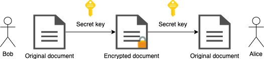

# 3. Technical prerequisites

Now that we have equipped ourselves with the ability to write computer programs, we will introduce ourselves to the components (or the data structures) of what makes a cryptocurrency.

A data structure is a collection of data values, the relationships among them, and the functions or operations that can be applied to the data.

In Racket, there's a special syntax (that is, a macro) named `define-struct` which allows us to capture data structures and come up with a new kind of abstraction.

In a sense, we already know how we can capture abstractions with `car`, `cons`, and `cdr`, however `define-struct` is much more convenient since once we defined our data structures it will automatically provide procedures for us to construct such data type and retrieve its values.

A few examples:

```racket
> (struct document (author title content))
> (struct book document (publisher))
```

Having entered the first command, we automatically get the procedures `document-author`, `document-title`, `document-content` in order to extract values from objects, and the procedure document in order to construct object of such type. Now, we can construct an object that is using this data structure:

```racket
> (define a-book
>   (document
>    "Boro Sitnikovski"
>    "Gentle Introduction to Blockchain with Lisp"
>    "Hello World"))
```

We can also use the automatically generated procedures to extract values from objects that are using this data structure:

```racket
> (document-author a-book)
"Boro Sitnikovski"
> (document-title a-book)
"Gentle Introduction to Blockchain with Lisp"
> (document-content a-book)
"Hello World"
```

Throughout this book, we will use serializable-struct (from the racket/serialize library) instead of struct, since this will allow for serializing data structures and writing them to the file system for example.

A structure in most programming languages is a composite data type (or record) declaration that defines a physically grouped list of variables to be placed under one name in a block of memory.

From the motivation in the previous section we can see a need of forming such a composite data type, where, for example, a block is a structure that contains a hash, an owner, transaction amount, etc.

## 3.1. Linked lists

A linked list is a linear collection of data elements, whose order is not given by their physical placement in memory, unlike arrays for example.
Instead, each element points to the next. So the order is completely determined by the data in the linked list.


The motivation for using a linked list is that it's a data structure that allows us to link several blocks together to make a blockchain.
We will cover lists in depth in the Introduction to Racket chapter.

Example in Racket

## 3.2. Encryption

Encryption is a two-way function; what is encrypted can be decrypted with the proper key. It is a method of encoding values such that only authorized persons can view their content.

So we can assume that there are functions E(x) and D(x) for encryption and decryption respectively. Now we want these functions to have the following properties:

1. E(x) != x, meaning that the encrypted value should not be the same as the value we're trying to encrypt
1. E(x) != D(x), meaning that the encrypted value should not be the same as the decrypted value
1. D(E(x)) = x, meaning that the decryption of an encrypted value should return the original value

So if we assume there's some kind of an encryption scheme, say E("Boro") = 426f726f, we can "safely" communicate with others the value 426f726f without actually exposing our original value, and only those who know the decryption scheme D(x) will be able to see that D(426f726f) = "Boro".

However, the scheme described above is what is called a symmetric algorithm, meaning that we share the functions E and D with the parties involved, and as such, may be open to attacks given how we want to design our transactions, which we will cover in a later topic.



So, what we want to use is what is called a asymmetric algorithm or a public-key cryptography. What this means it that we have two kind of keys: public and private. We share the public key with the world, and keep the private one to ourselves.


This algorithm scheme has a neat property in that only the private key can decode a message, and the public one can encode a message.

Note that the way we use the words encode and decode is abstract. This means that, for example, in terms of digital signatures for our transactions, a message can be signed with the sender's private key and can be verified by anyone who has access to the sender's public key.

So, given TransactionSignature = Sign(x, PrivateKey) and a verification function Verify(Message, x, key), we want to be able to do Verify(Message TransactionSignature, PublicKey) in order to confirm a transaction's ownership.

This brings us to wallets.

Wallet stores the public and private "keys" or "addresses" which can be used to receive or spend cryptocurrency coins. With the private key, it is possible to write new blocks (or transactions) on the blockchain, effectively spending the associated cryptocurrency. With the public key, it is possible for others to send currency to the wallet and verify signatures.

Example in Racket

## 3.3. Hashing

Hashing, however, is simpler than the encryption schemes described above, and is a one-way function that encodes text without a way to retrieve the original contents back.

One example why we would need to use such technique is because they have some interesting properties, such as providing us with the so called notion proof-of-work.

A proof-of-work system is an economic measure to deter denial of service attacks and other service abuses such as spam on a network by requiring some work from the service requester, usually meaning processing time by a computer.

Hashcash is a proof-of-work system, initially targeted for limiting email spam and other attacks. However, recently it's also become known for its usage in cryptocurrencies as part of the mining process. Hashcash was proposed in 1997 by Adam Backa. We will see how this algorithm works in details in the later chapters where we will implement it.

Mining is a validation of transactions. For this effort, successful miners obtain new cryptocurrency as a reward. The Hashcash algorithm is what we will use to implement mining.

In Bitcoin, the block reward started at 50 coins for the first block, and halves every on every 210000 blocks. This means every block up until block 210000 rewards 50 coins, while block 210001 rewards 25. As we will see in the code, we will come up with a function to determine the reward that is supposed to be given to the owner depending on the state of the blockchain at that point in time.

Another useful property hashing functions have is to connect two or more distinct blocks by having the information current-hash and previous-hash.

For example, block-1 may have a hash such as 0x123456 and block-2 may have a hash such as 0x345678. Now, block-2's previous-hash will be block-1's current-hash, that is, 0x123456, and in this way we've made a link between these two blocks.


Two or more blocks (or transactions) connected to each other form what is called a blockchain. The validity of each cryptocurrency coins is provided by it.

Fortunately for us, Racket has libraries that will provide this for us, so we don't have to dig deeper into how hashing and encryption and decryption works but a basic understanding of it will be sufficient.

Example in Racket
