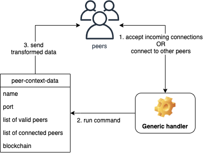

# 4. Extending the blockchain

In the previous chapter, we implemented the most basic concepts that form a blockchain. In this chapter, we will extend our blockchain with smart contracts and peer-to-peer support.

## 4.1. Smart contracts implementation

Bitcoin's blockchain is programmable - the transactions themselves can be programmed by users. For example, users can write scripts to add additional requirements that must be satisfied before sending money.

In section 2.4 we created an executable that we can send to our friends but they can no longer change the code because they don't have the original code, and even if they did not all users are programmers.

The point of smart contracts is to allow non-programmers to adjust the logic in the code without changing the original code.

### 4.1.1. `smart-contracts.rkt`

Our implementation will depend on transactions:

```racket
(require "transaction.rkt")
```

We have to extend our original `valid-transaction?` so that it will also consider contracts when calculating validity:

```racket
(define (valid-transaction-contract? t contract)
  (and (eval-contract t contract)
       (valid-transaction? t)))
```

We will now implement a procedure that will accept a transaction, a contract (scripting language) and return some value. This value can either be true, false, a number, or a string.

```racket
(define (eval-contract t c)
  (match c
    [(? number? x) x]
    [(? string? x) x]
    [`() #t]
    [`true #t]
    [`false #f]
    [`(if ,co ,tr ,fa) (if co tr fa)]
    [`(+ ,l ,r) (+ l r)]
    [else #f]))
```

We used a new syntax `match`. It is similar to `cond` except that it can check more complex structures. For example, if `c` matches `true` then it will return `#t`. If `c` matches a structure of the form `(if X Y Z)` then it will return the evaluation of `(if X Y Z)`.

A few example usages:

```racket
> (define test-transaction (transaction "BoroS" "Boro" "You" "a book"
  '() '()))
> (eval-contract test-transaction 123)
123
> (eval-contract test-transaction "Hi")
"Hi"
> (eval-contract test-transaction '())
#t
> (eval-contract test-transaction 'true)
#t
> (eval-contract test-transaction 'false)
#f
> (eval-contract test-transaction '(if #t "Hi" "Hey"))
"Hi"
> (eval-contract test-transaction '(if #f "Hi" "Hey"))
"Hey"
> (eval-contract test-transaction '(+ 1 2))
3
```

However, we still haven't used the transaction values in our procedure. Let's extend our scripting language with a few more commands:

```racket
...
    [`from (transaction-from t)]
    [`to (transaction-to t)]
    [`value (transaction-value t)]
...
```

Now we can do something like:

```racket
> (eval-contract test-transaction 'from)
"Boro"
> (eval-contract test-transaction 'to)
"You"
> (eval-contract test-transaction 'value)
"a book"
```

We will implement a few more operators so that our scripting language becomes more expressive:

```racket
...
    [`(* ,l ,r) (* l r)]
    [`(- ,l ,r) (- l r)]
    [`(= ,l ,r) (equal? l r)]
    [`(> ,l ,r) (> l r)]
    [`(< ,l ,r) (< l r)]
    [`(and ,l ,r) (and l r)]
    [`(or ,l ,r) (or l r)]
...
```

However, there is a problem in our language implementation. Consider the evaluations of `(+ 1 2)` and `(+ (+ 1 2) 3)`:

```racket
> (eval-contract test-transaction '(+ 1 2))
3
> (eval-contract test-transaction '(+ (+ 1 2) 3))
. . +: contract violation
```

The problem happens in the matching clause ``[`(+ ,l ,r) (+ l r)]``. when we match against `'(+ (+ 1 2) 3))` we end up with `(+ '(+ 1 2) 3)`, so Racket cannot sum a quoted list with a number. The solution to this problem is to *recursively* evaluate every sub-expression. So our match turns from ``[`(+ ,l ,r) (+ l r)]`` to ``[`(+ ,l ,r) (+ (eval-contract t l) (eval-contract t r))]``.

In this case, the evaluation will happen as follows:

```racket
(eval-contract t '(+ (+ 1 2) 3))
= (eval-contract t (list '+ (eval-contract t '(+ 1 2))
    (eval-contract t 3)))
= (eval-contract t (list '+ (+ 1 2) 3))
= (eval-contract t (list '+ 3 3))
= (eval-contract t '(+ 3 3))
= (eval-contract t 6)
= 6
```

It is important to recall the distinction between a quoted list and a non-quoted one: the latter will attempt evaluation. In this case, we just juggled with the quotation to produce the desired results.

We will have to rewrite all of our operators:

```racket
...
    [`(+ ,l ,r) (+ (eval-contract t l) (eval-contract t r))]
    [`(* ,l ,r) (* (eval-contract t l) (eval-contract t r))]
    [`(- ,l ,r) (- (eval-contract t l) (eval-contract t r))]
    [`(= ,l ,r) (= (eval-contract t l) (eval-contract t r))]
    [`(> ,l ,r) (> (eval-contract t l) (eval-contract t r))]
    [`(< ,l ,r) (< (eval-contract t l) (eval-contract t r))]
    [`(and ,l ,r) (and (eval-contract t l) (eval-contract t r))]
    [`(or ,l ,r) (or (eval-contract t l) (eval-contract t r))]
...
```

The `if` implementation in our language has the same problem. So we will also change it:

```racket
...
    [`(if ,co ,tr ,fa) (if (eval-contract t co)
                           (eval-contract t tr)
                           (eval-contract t fa))]
...
```

Thus, our final procedure becomes:

```racket
(define (eval-contract t c)
  (match c
    [(? number? x) x]
    [(? string? x) x]
    [`() #t]
    [`true #t]
    [`false #f]
    [`(if ,co ,tr ,fa) (if (eval-contract t co)
                           (eval-contract t tr)
                           (eval-contract t fa))]
    [`(+ ,l ,r) (+ l r)]
    [`from (transaction-from t)]
    [`to (transaction-to t)]
    [`value (transaction-value t)]
    [`(+ ,l ,r) (+ (eval-contract t l) (eval-contract t r))]
    [`(* ,l ,r) (* (eval-contract t l) (eval-contract t r))]
    [`(- ,l ,r) (- (eval-contract t l) (eval-contract t r))]
    [`(= ,l ,r) (= (eval-contract t l) (eval-contract t r))]
    [`(> ,l ,r) (> (eval-contract t l) (eval-contract t r))]
    [`(< ,l ,r) (< (eval-contract t l) (eval-contract t r))]
    [`(and ,l ,r) (and (eval-contract t l) (eval-contract t r))]
    [`(or ,l ,r) (or (eval-contract t l) (eval-contract t r))]
    [else #f]))
```

Now users can supply scripting code such as `(if (= (+ 1 2) 3) from to)`:

```racket
> (eval-contract test-transaction '(if (= (+ 1 2) 3) from to))
"Boro"
> (eval-contract test-transaction '(if (= (+ 1 2) 4) from to))
"You"
```

Note that a contract in our implementation is just an S-expression.

Finally, we provide the output which is just the transaction validity check:

```racket
(provide valid-transaction-contract?)
```

### 4.1.2. Updating existing code

Now that we implemented the smart-contracts logic, the next thing we need to address is the frontend - how will our users use it. For that, we will update our implementation to support contracts by reading from a file. If a file named `contract.script` exists, we will read and parse it (with `read`) and then run the code.

Within `blockchain.rkt` we will slightly rewrite the money sending procedure to accept contracts:

```racket
(define (send-money-blockchain b from to value c)
  (letrec ([my-ts
            (filter (lambda (t) (equal? from (transaction-io-owner t)))
                    (blockchain-utxo b))]
           [t (make-transaction from to value my-ts)])
    (if (transaction? t)
        (let ([processed-transaction (process-transaction t)])
          (if (and
               (>= (balance-wallet-blockchain b from) value)
               (valid-transaction-contract? processed-transaction c))
              (add-transaction-to-blockchain b processed-transaction)
              b))
        (add-transaction-to-blockchain b '()))))
```

We will also update `blockchain.rkt` with `(require "smart-contracts.rkt")`. Then we update `utils.rkt` to add this helper procedure for reading contracts:

```racket
(define (file->contract file)
  (with-handlers ([exn:fail? (lambda (exn) '())])
    (read (open-input-file file))))
```

Make sure to add `file->contract` to the list of `provide`s in `utils.rkt`.

Finally, we need to update every usage of `(send-money-blockchain ...)` to `(send-money-blockchain ... (file->contract "contract.script"))` in `main.rkt`.

## 4.2. Peer-to-peer implementation

In section 3.6.2 we used DrRacket to execute our blockchain implementation. That's okay for testing purposes, however, if we wanted to share our implementation with other users and ask them to use it, it's kind of inconvenient as in our implementation there was no way to share data between different users.

In this section we will implement peer-to-peer support so that users who are interested in our implementation can "join" the system/community.

Before we dive into the implementation, we will give a high overview of the architecture we will build.



Every peer node (in the peers list) will consist of a `peer-context-data` and a generic handler for transforming this contextual data. Further, there will be two ways to establish communication with other peers:

1. A peer will accept new connections from other peers
1. A peer will try to connect/make new connections to other peers

Whenever a connection is established, peers will communicate with each other through the generic handler, parsing and evaluating commands such as syncing/updating the blockchain, updating the list of peers, etc.

### 4.2.1. `peer-to-peer.rkt`

To start, we will add dependencies for the block implementation, and also rely on serialization for sending data to other peers:

```racket
(require "blockchain.rkt")
(require "block.rkt")
(require racket/serialize)
```

#### 4.2.1.1. Peer context structure

We will implement structures that hold information about the peers so that we will have a reference to send data to the correct channels. The `peer-info` structure contains an IP and a port of a peer:

```racket
(struct peer-info
  (ip port)
  #:prefab)
```

The `peer-info-io` structure additionally contains IO ports for sending and receiving data:

```racket
(struct peer-info-io
  (pi input-port output-port)
  #:prefab)
```

The reason we separate `peer-info` and `peer-info-io` is that later in `main-p2p.rkt` we won't have the context of input/output ports (before a connection to a peer is established), so it gives us a nice way to re-use the structure.

Finally, `peer-context-data` contains all the information needed for a single peer, that is:

1. List of valid peers
1. List of connected peers
1. A reference to the blockchain

```racket
(struct peer-context-data
  (name
   port
   [valid-peers #:mutable]
   [connected-peers #:mutable]
   [blockchain #:mutable])
  #:prefab)
```

The list[^ch4n1]  of valid peers will be updated depending on info retrieved from connected peers. The list of connected peers will be a (not necessarily strict) subset of `valid-peers`. Blockchain will be updated from data with other peers.

#### 4.2.1.2. Generic handler

The generic handler will be a `handler` procedure that will be used both by the server and the client. It will be a procedure that accepts commands (similar commands as our smart contracts' `eval-contract` implementation), and then does something depending on the command.

Here's a list of commands that peers will send to each other:

| Request                 | Response              | Notes |
| ----------------------- | --------------------- | ----- |
| `get-valid-peers`       | `valid-peers:X`       | A peer may request a list of valid peers. The response will be `X` - valid peers. Note that this response will automatically trigger the command `valid-peers` |
| `get-latest-blockchain` | `latest-blockchain:X` | A peer may request the latest blockchain from another peer. The response will be `X` - latest blockchain. This triggers the command `latest-blockchain`.
| `latest-blockchain:X`   |                       | When a peer gets this request it will update the blockchain, given it is valid. |
| `valid-peers:X`         |                       | When a peer gets this request it will update the list of valid peers. |

Here is our handler implementation. It will accept a `peer-context`, and an input/output ports. Given these it will read the input (command) and send the appropriate output (evaluated command) back to the peer:

```racket
(define (handler peer-context in out)
  (flush-output out)
  (define line (read-line in))
  (when (string? line) ; it can be eof
    (cond [(string-prefix? line "get-valid-peers")
           (fprintf out "valid-peers:~a\n"
                    (serialize
                     (set->list
                      (peer-context-data-valid-peers peer-context))))
           (handler peer-context in out)]
          [(string-prefix? line "get-latest-blockchain")
           (fprintf out "latest-blockchain:"
           (write (serialize (peer-context-data-blockchain peer-context)) out)
           (handler peer-context in out)]
          [(string-prefix? line "latest-blockchain:")
           (begin (maybe-update-blockchain peer-context line)
                  (handler peer-context in out))]
          [(string-prefix? line "valid-peers:")
           (begin (maybe-update-valid-peers peer-context line)
                  (handler peer-context in out))]
          [(string-prefix? line "exit")
           (fprintf out "bye\n")]
          [else (handler peer-context in out)])))
```

We used some new procedures:

1. `flush-output` - an output buffer is filled with bytes. We need to flush (empty) this buffer every time we want to send a message, to avoid re-sending the previous messages again
1. `read-line` - similar to `read` except that it will stop `read`ing once a newline is reached
1. `string-prefix?` - checks to see if a string starts with some other string
1. `fprintf` - similar to `printf` except that we can also supply the first parameter to be specified to which port to send the message to
1. `set->list` - converts a set to a list

There's a little trick involved in the `latest-blockchain` case - we used `write` instead of `(fprintf out "latest-blockchain:~a\n")`. The reason for that is that `print` (and thus `printf`, `fprintf`) is used mostly for debugging, not as a tool that we can rely on for output that needs to be formatted in a specific way. For example, `print` prints strings with quotation marks, and this will mess up when we try to deserialize the data we received.

The next step is to implement `maybe-update-blockchain` and `maybe-update-valid-peers`.

```racket
(define (maybe-update-blockchain peer-context line)
  (let ([latest-blockchain
         (trim-helper line #rx"(latest-blockchain:|[\r\n]+)")]
        [current-blockchain (peer-context-data-blockchain peer-context)])
    (when (and (valid-blockchain? latest-blockchain)
               (> (get-blockchain-effort latest-blockchain)
                  (get-blockchain-effort current-blockchain)))
      (printf "Blockchain updated for peer ~a\n"
              (peer-context-data-name peer-context))
      (set-peer-context-data-blockchain! peer-context
                                         latest-blockchain))))
```

This procedure will update the blockchain only when it is valid and the effort is higher than the current one. Here's how we define the effort:

```racket
(define (get-blockchain-effort b)
  (foldl + 0 (map block-nonce (blockchain-blocks b))))
```

Updating valid peers is just merging the list of valid peers with the newly received one, mutating the `peer-context` structure:

```racket
(define (maybe-update-valid-peers peer-context line)
  (let ([valid-peers (list->set
                      (trim-helper line #rx"(valid-peers:|[\r\n]+)"))]
        [current-valid-peers (peer-context-data-valid-peers
                              peer-context)])
    (set-peer-context-data-valid-peers!
     peer-context
     (set-union current-valid-peers valid-peers))))
```

This procedure is just a helper one that will remove a command (prefix) from a string, allowing us to focus on the input. For example, when we receive `valid-peers:X` it will remove `valid-peers:` allowing us to retrieve `X` easily.

```racket
(define (trim-helper line x)
  (deserialize
   (read
    (open-input-string
     (string-replace line x "")))))
```

We concluded our `handler` implementation.

#### 4.2.1.3. Server implementation

In the case where one peer connects to the server, here's what should happen:

1. Our program will wait for the peer to send some command
1. It will use the `handler` procedure to transform the necessary data
1. It will send the transformed data back to the peer

However, if more than one peer connects, then our procedure will "block", in the sense that the second peer will have to wait for the first one to be served, and the third will have to wait for the second, etc.

To resolve this issue, we turn to threads. `accept-and-handle` is the main procedure that will serve the incoming clients. It accepts a new connection and a peer context and launches `handler` in a thread:

```racket
(define (accept-and-handle listener peer-context)
  (define-values (in out) (tcp-accept listener))
  (thread
   (lambda ()
     (handler peer-context in out)
     (close-input-port in)
     (close-output-port out))))
```

We use a new procedure `tcp-accept` that accepts a connection and returns input and output ports and using the `define-values` syntax we store both of these values.

`peers/serve` is the main server listener. This is straight copy-pasted from the Racket documentation, and the curious reader can navigate to the documentation and read more about the implementation details. In short, a custodian is a kind of container that makes sure there are no bogus threads or input/output ports in the memory and takes care of this for us.

```racket
(define (peers/serve peer-context)
  (define main-cust (make-custodian))
  (parameterize ([current-custodian main-cust])
    (define listener
      (tcp-listen (peer-context-data-port peer-context) 5 #t))
    (define (loop)
      (accept-and-handle listener peer-context)
      (loop))
    (thread loop))
  (lambda ()
    (custodian-shutdown-all main-cust)))
```

#### 4.2.1.4. Client implementation

Now we have `connect-and-handle` that tries to connect to other peers. It is similar to `accept-and-handle`, but kind of dual, in that it does not accept new connections, rather tries to make a new connection:

```racket
(define (connect-and-handle peer-context peer)
  (begin
    (define-values (in out)
      (tcp-connect (peer-info-ip peer)
                   (peer-info-port peer)))

    (define current-peer-io (peer-info-io peer in out))

    ; Add current peer to list of connected peers
    (set-peer-context-data-connected-peers!
     peer-context
     (cons current-peer-io
           (peer-context-data-connected-peers peer-context)))

    (thread
     (lambda ()
       (handler peer-context in out)
       (close-input-port in)
       (close-output-port out)
       ; Remove peer from list of connected peers once handler is finished
       (set-peer-context-data-connected-peers!
        peer-context
        (set-remove
         (peer-context-data-connected-peers peer-context)
         current-peer-io))))))
```

Now we have this generic procedure for the client, `peers/connect`, that makes sure we're connected with all known peers. We use threads, again, for the same reason as in the server - we do not want this procedure to block the program from connecting to other clients while it tries to connect to one. This procedure is dual to `peers/serve`, as well as `tcp-connect` to `tcp-accept`.

```racket
(define (peers/connect peer-context)
  (define main-cust (make-custodian))
  (parameterize ([current-custodian main-cust])
    (define (loop)
      (let ([potential-peers (get-potential-peers peer-context)])
        (for ([peer potential-peers])
          (with-handlers ([exn:fail? (lambda (x) #t)])
            (connect-and-handle peer-context peer))))
      (sleep 10)
      (loop))
    (thread loop))
  (lambda ()
    (custodian-shutdown-all main-cust)))
```

To implement `get-potential-peers`, we first get the list of connected and valid peers from the peer context. The valid peers that are not in the list of connected peers are potential peers we can make new connections with.

```racket
(define (get-potential-peers peer-context)
  (let ([current-connected-peers
         (list->set
          (map peer-info-io-pi
               (peer-context-data-connected-peers peer-context)))]
        [valid-peers (peer-context-data-valid-peers peer-context)])
    (set-subtract valid-peers current-connected-peers)))
```

#### 4.2.1.5. Integrating implementations

Now we have this procedure that will ping all peers (that have connected to us, or we connected with them) in an attempt to sync blockchains and update list of valid peers:

```racket
(define (peers/sync-data peer-context)
  (define (loop)
    (sleep 10)
    (for [(p (peer-context-data-connected-peers peer-context))]
      (let ([in (peer-info-io-input-port p)]
            [out (peer-info-io-output-port p)])
        (fprintf out "get-latest-blockchain\nget-valid-peers\n")
        (flush-output out)))
    (printf "Peer ~a reports ~a valid and ~a connected peers.\n"
            (peer-context-data-name peer-context)
            (set-count (peer-context-data-valid-peers peer-context))
            (set-count (peer-context-data-connected-peers peer-context)))
    (loop))
  (define t (thread loop))
  (lambda ()
    (kill-thread t)))
```

The following procedure is the entry point, where everything is launched together:

```racket
(define (run-peer peer-context)
  (begin
    (peers/serve peer-context)
    (peers/connect peer-context)
    (peers/sync-data peer-context)))
```

Finally, we export the necessary objects:

```racket
(provide (struct-out peer-context-data)
         (struct-out peer-info)
         run-peer)
```

### 4.2.2. Updating existing code

We need to modify `main-helper.rkt` to include our peer-to-peer implementation:

```racket
; ...
(require "peer-to-peer.rkt")
; ...

(provide (all-from-out "blockchain.rkt")
         (all-from-out "utils.rkt")
         (all-from-out "peer-to-peer.rkt")
         format-transaction print-block print-blockchain print-wallets)
```

### 4.2.3. `main-p2p.rkt`

```racket
(require "./main-helper.rkt")
```

This will convert a string of format `IP:port` to `peer-info` structure:

```racket
(define (string-to-peer-info s)
  (let ([s (string-split s ":")])
    (peer-info (car s) (string->number (cadr s)))))
```

This will create a new wallet for us to use:

```racket
(define wallet-a (make-wallet))
```

Finally, the creation of new blockchain that initializes wallets, transactions, unspent transactions, and blockchain:

```racket
(define (initialize-new-blockchain)
  (begin
    (define coin-base (make-wallet))

    (printf "Making genesis transaction...\n")
    (define genesis-t
      (make-transaction coin-base wallet-a 100 '()))

    (define utxo (list
                  (make-transaction-io 100 wallet-a)))

    (printf "Mining genesis block...\n")
    (define b (init-blockchain genesis-t "1337cafe" utxo))
    b))
```

Some command-line parsing (TODO: what's a command-line?)

```racket
(define args (vector->list (current-command-line-arguments)))

(when (not (= 3 (length args)))
  (begin
    (printf
     "Usage: racket main-p2p.rkt dbfile.data port ip1:port1,...\n")
    (exit)))

(define db-filename (car args))
(define port (string->number (cadr args)))
(define valid-peers
  (map string-to-peer-info (string-split (caddr args) ",")))
```

This will try to read the blockchain from a file (DB), otherwise create a new one:

```racket
(define b
  (if (file-exists? db-filename)
      (file->struct db-filename)
      (initialize-new-blockchain)))
```

Peer initialization:

```racket
(define peer-context
  (peer-context-data "Test peer" port (list->set valid-peers) '() b))
(define (get-blockchain) (peer-context-data-blockchain peer-context))

(run-peer peer-context)
```

We keep exporting the database to have up-to-date info whenever a user quits the app.

```racket
(define (export-loop)
  (begin
    (sleep 10)
    (struct->file (get-blockchain) db-filename)
    (printf "Exported blockchain to '~a'...\n" db-filename)
    (export-loop)))

(thread export-loop)
```

Here's a procedure to keep mining empty blocks, as the p2p runs in threaded mode.

```racket
(define (mine-loop)
  (let ([newer-blockchain
         ; This blockchain includes a new block
         (send-money-blockchain (get-blockchain) wallet-a wallet-a 1)])
    (set-peer-context-data-blockchain! peer-context newer-blockchain)
    (printf "Mined a block!")
    (sleep 5)
    (mine-loop)))

(mine-loop)
```

## 4.3. Putting everything together

As a recap, we did the following:

1. Section 2.4: We created an executable in DrRacket.
1. Section 3.6.2: We executed our basic blockchain implementation.
1. Section 4.1: We implemented smart contracts.
1. Section 4.2: We implemented peer-to-peer support.

In this section we will create the final executable, and then use it to test our blockchain implementation with p2p, and also test smart contracts.

## Summary

We added two new important features to our blockchain implementation: smart contracts and peer-to-peer support. This concludes our blockchain implementation. The next steps (to create a real-world blockchain) would be to harden the security, tweak the communication logic and blockchain effort algorithms, etc.

[^ch4n1]: More precisely, a set, since we will use operations such as subtract.
